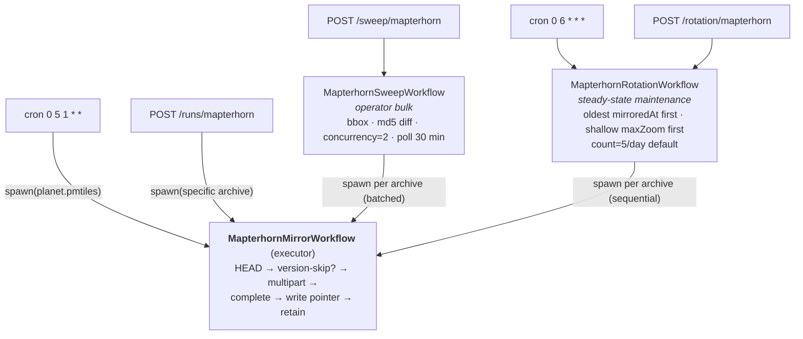

# Mapterhorn mirror — operator notes

This worker snapshots [Mapterhorn](https://mapterhorn.com/)'s PMTiles
archives into R2 so the main terrain worker can serve DEM tiles
without depending on `download.mapterhorn.com` being reachable.

Upstream manifest lives at
[`download.mapterhorn.com/download_urls.json`](https://download.mapterhorn.com/download_urls.json)
and lists 458 archives totalling ~9.8 TiB at this writing:

- `planet.pmtiles` — global z0–z12, ~705 GB
- `{z6}-{x}-{y}.pmtiles` × 457 — per-z6 regional z13–z17, 299 B to
  352 GB depending on terrain complexity

Snapshots land under `mirror/mapterhorn/{YYYYMMDD}/{archive}` keyed
by the upstream `Last-Modified` date, with a per-archive pointer
`mirror/mapterhorn/{archive}.latest.json`. The bulk-sweep workflow
(`MapterhornSweepWorkflow`) reads
`mirror/mapterhorn/manifest.last.json` for md5sum-based diffing so a
sweep only re-pulls archives the upstream actually rebuilt.

## Architecture

One **executor** workflow does the actual mirroring; two
**orchestrators** decide which archives the executor runs against. All
three live in `../src`.

Shared helpers (manifest fetch, bbox filter, spawn-and-poll loop)
live in `mapterhorn-orchestrator.ts` and are used by both
orchestrators below.



- **`MapterhornMirrorWorkflow`** (`mapterhorn-workflow.ts`) — the
  executor. Pulls one archive into R2 over a multipart upload.
  Range-fetches the upstream in `MAPTERHORN_PART_SIZE` chunks (100 MiB
  by default), one `step.do` per part. **Version-skip:** if the
  `{archive}.latest.json` pointer already records the upstream's
  current Last-Modified date (and the archive body is still in R2),
  the multipart upload is skipped and only the pointer's
  `mirroredAt` is refreshed. Idempotent against unchanged upstream,
  so the cron and orchestrators can call it freely.
- **`MapterhornSweepWorkflow`** (`sweep-workflow.ts`) — orchestrator
  for operator bulk fills. Fans out per-archive Mirror runs against
  the upstream manifest, with md5sum diffing, bbox/archive filters,
  a `maxItems` safety brake, and bounded concurrency
  (`MAPTERHORN_SWEEP_CONCURRENCY`, default 2). Polls children with
  `step.sleep(30 minutes)` between checks so long-tail runs don't
  burn the step budget. **Use when** you want to mirror "every
  archive in this bbox" in one operator gesture.
- **`MapterhornRotationWorkflow`** (`rotation-workflow.ts`) —
  orchestrator for steady-state maintenance. Fires daily and runs the
  Mirror against a small set of archives picked by `(mirroredAt asc,
  max_zoom asc, name)` — oldest first, then shallow zoom first
  (so the 157 z=13-only archives, ~232 MB each, fill out the world
  before the z=16+ multi-GB ones). Default 5/day. Combined with the
  executor's version-skip, the rotation converges on a calm
  steady-state once everything is mirrored: each day's picks finish
  in seconds via skip until the upstream rebuilds something.

Workflow limits in `wrangler.toml` are bumped to 25,000 steps for
the mirror and sweep classes — planet.pmtiles at 100 MiB parts is
~6,731 steps, and a full sweep can chain thousands of poll steps
across hundreds of children. Rotation spawns at most a few children
per invocation so it sits comfortably under the default budget.

## Triggers

- Cron `0 5 1 * *` (monthly, 05:00 UTC) — refreshes `planet.pmtiles`
  via `MapterhornMirrorWorkflow`. Staggered after the 03:00 UTC
  Protomaps cron. Skipped in seconds when upstream Last-Modified
  hasn't changed.
- Cron `0 6 * * *` (daily, 06:00 UTC) — rotates through z13+ regional
  archives via `MapterhornRotationWorkflow`, default 5 per day.
- Manual POST `/runs/mapterhorn` with `{archive: "..."}` — runs the
  executor against a single archive (any name from
  `download_urls.json`).
- Manual POST `/sweep/mapterhorn` — runs the sweep. Body fields:
  `bbox`, `archives`, `skipPlanet`, `force`, `concurrency`,
  `maxItems`. See `sweep-workflow.ts` for full semantics.
- Manual POST `/rotation/mapterhorn` — runs the rotation. Body
  fields: `bbox` (limit candidates), `count` (process up to N
  archives in this invocation; default from
  `MAPTERHORN_ROTATION_DEFAULT_COUNT`).

All write endpoints require `authorization: Bearer $MIRROR_TOKEN`.

## Initial-mirror timing (2026-05-19)

Captured during the first end-to-end runs against production R2. All
times are wall-clock from `POST /runs/mapterhorn` to terminal
`status=complete`; bandwidth is amortized including the workflow's
step boundaries, so they're real-world numbers a planner can reuse.

| archive | size | parts | wall time | notes |
|---|---|---|---|---|
| `6-0-21.pmtiles` | 30 MB | 1 | <1 min | Smallest test (Aleutians). Single-part multipart upload still works. |
| `6-37-32.pmtiles` | 213 MB | 3 | <1 min | Africa Great Lakes. First multipart proper. |
| `6-22-30.pmtiles` | 645 MB | 7 | <1 min | South America. Ran in parallel with the previous; both finished within the same minute. |
| `planet.pmtiles` | **705 GB** | **6,731** | **~14h** | World z0–z12. Started 04:40 UTC, completed 18:37 UTC. ~50 GB/h average. |

Implications for capacity planning:

- A full 9.8 TiB first-time mirror at the observed planet throughput
  (~50 GB/h) and concurrency=2 would take **~4 days** of wall time.
  Subsequent monthly refreshes are bounded by what's actually
  rebuilt upstream, not the full set.
- The 30s `step.do` CPU budget is comfortably enough for a 100 MiB
  part — no part-timeout retries surfaced across the 6,731 parts.
- R2 standard storage for the full 9.8 TiB is ~$147/month. The
  current set (planet + 3 regionals, ~706 GB) is ~$10/month.

## Read-path verification (2026-05-20)

Smoke-tested the main worker with `MAPTERHORN_SOURCE=mirror` against
the mirrored set above via `wrangler dev --remote`. All four paths
the source has to handle resolved correctly:

| scenario | tile | result |
|---|---|---|
| z≤12 globally → planet.pmtiles | z=8 over Tokyo | hit, mean 70 m, max 1218 m (Tanzawa range) — sensible |
| z=12 in Japan (planet max zoom) | z=12 over Tokyo Bay | hit, mean 8 m, min −9 m — Tokyo Bay reclaimed land, plausible |
| z≥13 in a mirrored region | z=13 over Ruwenzori (6-37-32) | hit, mean 1478 m — East African Rift highlands |
| z≥13 in a region without a mirror | z=13 over Japan (6-55-25 missing) | no-coverage (`hit: false`) — no upstream fallback, no error |

Notes:

- Mapterhorn regional archives are sparse — at z=13 inside a covered
  z6 cell, individual XYZ tiles may not exist. The mirror source
  returns `null` for those without erroring, same shape as a missing
  archive.
- Initial `fetchMs` was 500–900 ms (PMTiles header + first directory
  page fetched cold). Subsequent reads within the same isolate hit
  the in-memory PMTiles handle and the decoded-tile LRU.

## Switching the read path

The main worker's `MAPTERHORN_SOURCE` env var (default `upstream`)
has three settings:

- `upstream` — direct `tiles.mapterhorn.com`. No R2 dependency.
- `mirror` — all reads from R2. Z ≥ 13 in regions without a mirrored
  archive return as no-coverage. Only safe once sweep / rotation has
  populated every region you care about.
- `hybrid` — recommended intermediate. Mirrored `planet.pmtiles` for
  z ≤ 12, mirrored regional `6-X-Y.pmtiles` for z ≥ 13 when it
  exists, upstream fallback otherwise. The mirrored-regional set is
  discovered by R2-listing `{archive}.latest.json` at the prefix root
  (cached per isolate, 1 h TTL), so a new sweep / rotation run
  becomes effective for reads on the next refresh — no deploy required.

Pair `mirror` or `hybrid` with a `Tileset.version` bump in
`src/tilesets.ts`. The mirror DEM source omits the per-tile freshness
probe (snapshot version is the pin), so a version bump is the clean
way to retire L2 entries generated under the old backend.

Hybrid mode rationale: planet.pmtiles is just one ~700 GB file we
can mirror in ~14 h and refresh monthly for ~$10/mo storage. Z ≥ 13
is 9 TiB across 457 regional archives — mirroring all of that costs
~$150/mo and several days of sweep wall time. Hybrid captures
most of the SLA win (z ≤ 12 traffic stops depending on upstream)
without the regional-archive bill, and lets us mirror specific
regions opportunistically as needed.

Pre-flight checks before flipping:

1. `mirror/mapterhorn/planet.pmtiles.latest.json` exists in R2.
2. For `mirror` mode: the z13+ regions you care about are mirrored.
   For `hybrid` mode: no preconditions — uncovered regions fall back
   to upstream.
3. Test locally first:

   ```bash
   cd <repo root>
   echo 'MAPTERHORN_SOURCE = "hybrid"' >> .dev.vars
   npx wrangler dev --remote
   # then curl http://localhost:8787/debug/dem?z=8&x=227&y=100 etc.
   # expect dem == "mapterhorn-hybrid" in the response
   ```

## Observability

Three surfaces, in order of granularity:

1. **Live tail** — `cd mirror && npx wrangler tail` streams every
   `console.log` from the worker in real time. The workflows emit
   structured JSON events on the significant transitions:
   `mirror_init` (with `kind: "fresh" | "skip"` and part counts),
   `mirror_skipped`, `mirror_complete`, `sweep_planned`,
   `sweep_complete`, `rotation_picked` (chosen archives + their
   staleness + `maxZoom`), `rotation_child_done`, plus
   the cron-trigger `mirror_scheduled` events from `scheduled()`.
2. **Cloudflare dashboard → Workers → reearth-terrain-mirror → Logs**
   — the last 100 invocations are visible with their console output,
   no setup required (`[observability] enabled = true` in
   `wrangler.toml`). Default retention is 7 days. For long-term
   retention or external sinks (S3, Datadog, etc.), enable Logpush
   on the worker — that's an account-level configuration outside
   this repo.
3. **Workflows step-level view** — the Cloudflare dashboard's
   Workflows page lists every instance ever started, with its
   per-step status, retries, and stored output. Useful for
   forensics after a failure, since each `step.do` boundary is
   independently persisted by the Workflows engine even if `console`
   output is gone.

R2 state is also self-describing: `mirror/mapterhorn/manifest.last.json`
records the sweep's md5sum map and `{archive}.latest.json`
records the per-archive version + `mirroredAt`. So even with no
logs at all you can reconstruct "what's mirrored and when" from R2
directly.

## R2 layout reference

```
mirror/mapterhorn/
  manifest.last.json                       # sweep state (md5 diff)
  planet.pmtiles.latest.json               # per-archive pointer
  6-X-Y.pmtiles.latest.json                # per-regional pointer
  {YYYYMMDD}/
    planet.pmtiles                         # actual archive
    6-X-Y.pmtiles                          # actual regional archive
```

Retention: `MAPTERHORN_RETAIN_VERSIONS` (default 2) old versions are
kept per archive; older snapshots are deleted by the workflow's
`retain` step after a successful upload.
